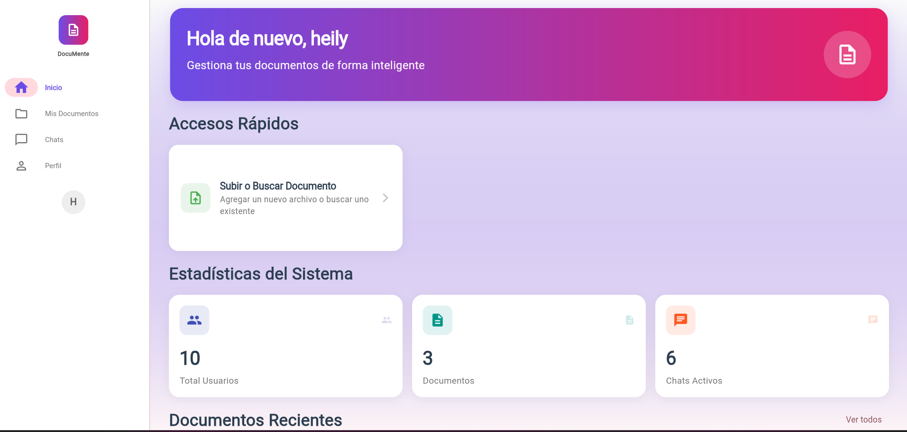
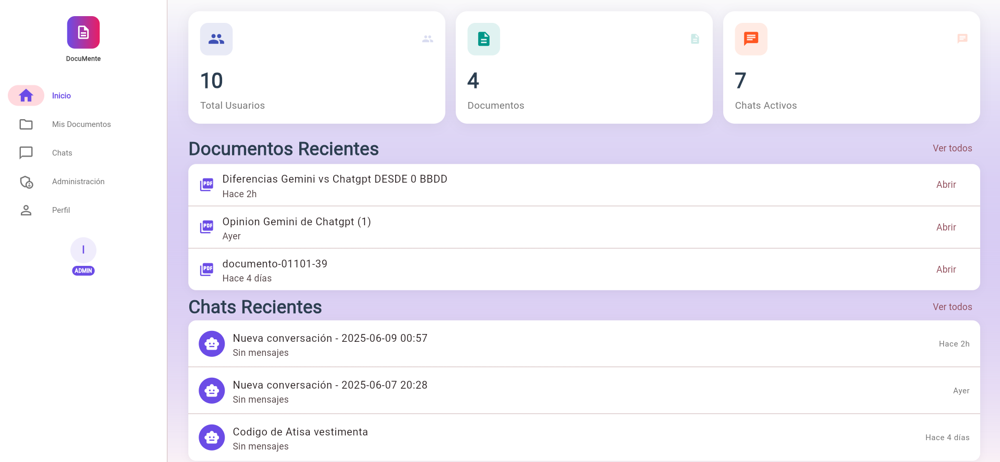
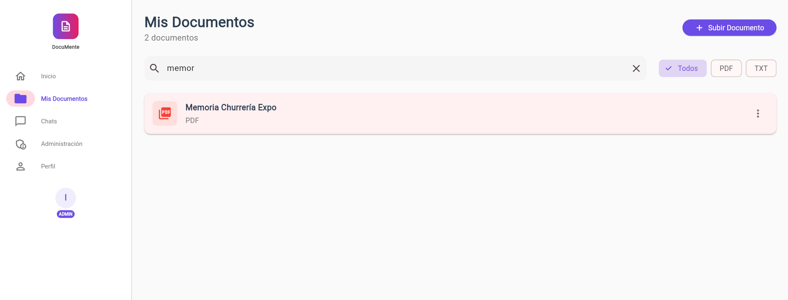
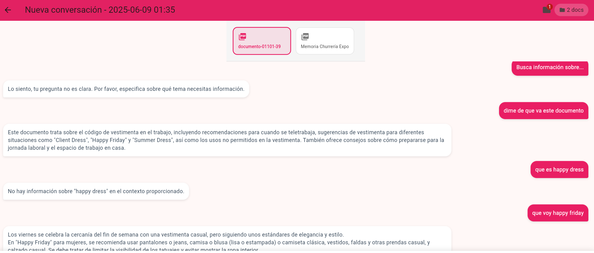
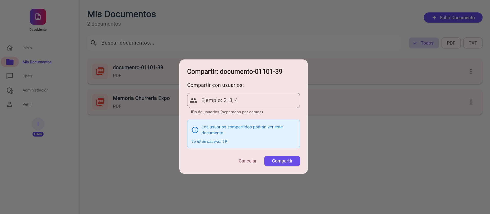
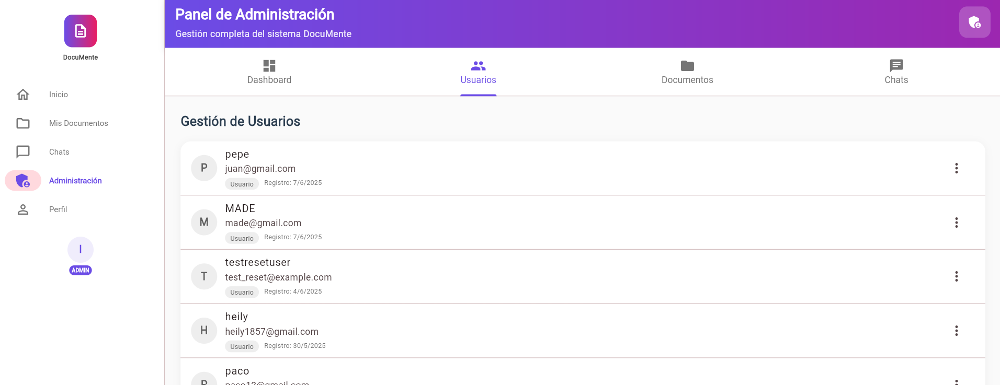
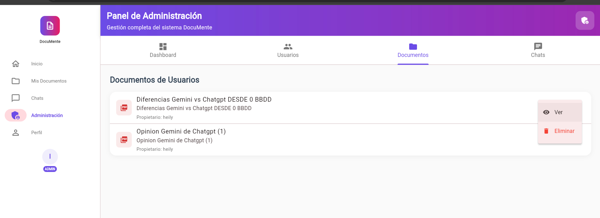
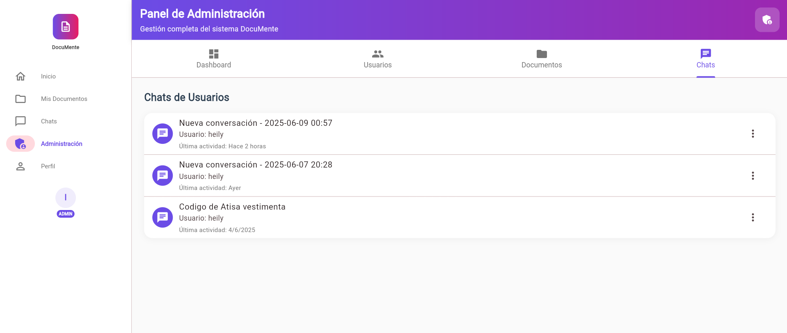

# 📚 MentIA - Asistente de Documentos con IA

## 🎬 Demo del Proyecto

### Video Presentación

https://www.youtube.com/watch?v=CyXpIo2UoJ4

_Video demostrativo mostrando todas las funcionalidades del sistema_

## 🎯 Descripción General

**MentIA** es una plataforma web enterprise-ready que transforma documentos corporativos en conocimiento accesible mediante IA conversacional. Reduce drásticamente el tiempo de búsqueda de información permitiendo a los usuarios interactuar con sus documentos usando lenguaje natural.

### 🌟 Características Principales

- **🤖 Chat RAG con Streaming**: IA conversacional usando Google Gemini 1.5 Pro con respuestas en tiempo real
- **📄 Soporte Multi-formato**: Procesa PDFs, TXT, Excel, CSV hasta 100MB
- **🔍 Búsqueda Semántica**: Búsqueda vectorial avanzada con ChromaDB (embeddings 768 dimensiones)
- **💬 WebSocket Bidireccional**: Chat en tiempo real con indicadores de escritura tipo WhatsApp
- **👥 Sistema de Compartición**: Comparte documentos con permisos granulares
- **🔐 Seguridad Empresarial**: JWT + Refresh Tokens + Token Blacklisting
- **📊 Dashboards Diferenciados**: Paneles específicos para usuarios y administradores
- **📱 Diseño Responsivo**: Flutter Web con Material Design 3
- **⚡ Alto Rendimiento**: Soporta 1000+ conexiones concurrentes

## 🏗️ Arquitectura

### Arquitectura Backend (Capas)

```
backend/
├── src/
│   ├── api/              # Endpoints API (60+ endpoints REST)
│   │   ├── endpoints/    # Controllers organizados por dominio
│   │   ├── middleware/   # Rate limiting, CORS, excepciones
│   │   └── helpers/      # Utilidades para WebSocket
│   ├── services/         # Lógica de negocio (25+ servicios)
│   │   ├── chat/         # Servicios de chat y streaming
│   │   └── user_services/# Servicios específicos de usuario
│   ├── repositories/     # Acceso a datos
│   ├── models/           # Modelos Pydantic y esquemas
│   ├── core/            # Componentes centrales
│   │   ├── auth.py      # JWT y autenticación
│   │   ├── websocket_manager.py # Gestión WebSocket
│   │   └── rate_limit.py # Rate limiting configurado
│   ├── config/          # Configuración y settings
│   └── utils/           # Utilidades y helpers
```

### Arquitectura Frontend

```
frontend/
├── lib/
│   ├── screens/         # 13+ pantallas completas
│   ├── services/        # Servicios API y WebSocket
│   ├── providers/       # State Management con Provider
│   ├── models/          # Modelos de datos tipados
│   ├── widgets/         # Componentes reutilizables
│   ├── utils/           # Validadores y helpers
│   └── config/          # Configuración de API
```

## 🚀 Stack Tecnológico

### Backend

- **FastAPI 0.104.1**: Framework async de alto rendimiento
- **PostgreSQL/Supabase 2.0.3**: Base de datos con RLS y funciones optimizadas
- **ChromaDB 0.4.18**: Base de datos vectorial dockerizada
- **Google Gemini AI**: Modelo de lenguaje para RAG
- **WebSockets 12.0**: Comunicación bidireccional en tiempo real
- **Slowapi 0.1.9**: Rate limiting granular (20 msg/min)
- **Loguru 0.7.2**: Logging estructurado
- **Docker Compose**: Orquestación de servicios

### Frontend

- **Flutter Web 3.19+**: Framework multiplataforma
- **Provider**: Gestión de estado reactivo
- **Dio 5.0**: Cliente HTTP con interceptores
- **Web Socket Channel**: Cliente WebSocket
- **Material Design 3**: Sistema de diseño moderno

## 📊 Métricas de Rendimiento

- **Tiempo de respuesta**: <200ms (95 percentil)
- **Procesamiento asíncrono**: Archivos hasta 100MB
- **Búsqueda vectorial**: <200ms con caché
- **WebSocket**: 20 mensajes/minuto por usuario
- **Concurrencia**: 1000+ conexiones simultáneas

## 📋 Requisitos Previos

- Python 3.9+
- Flutter 3.10+
- Docker y Docker Compose
- PostgreSQL 14+ o cuenta Supabase
- API Key de Google Gemini

## 🚀 Inicio Rápido

```bash
# Backend
cd back
python -m uvicorn src.main:app --host 127.0.0.1 --port 2690 --reload

# Frontend (nueva terminal)
cd front/frontend_flutter
flutter run -d chrome --web-port=53793
```

## 🛠️ Instalación Completa

### 1. Clonar el Repositorio

```bash
git clone https://github.com/tu-usuario/mentia.git
cd mentia
```

### 2. Configurar el Backend

```bash
cd back
python -m venv venv
source venv/bin/activate  # Windows: venv\Scripts\activate
pip install -r requirements.txt
```

#### Configurar variables de entorno

```bash
cp .env.example .env
# Editar .env con tus credenciales
```

#### Iniciar servicios con Docker

```bash
docker-compose up -d
```

### 3. Configurar el Frontend

```bash
cd ../front/frontend_flutter
flutter pub get
flutter run -d chrome --web-port=53793
```

## 📖 Uso del Sistema

### Usuarios de Prueba

**Usuario Regular:**

- Email: `heily1857@gmail.com`
- Contraseña: `paco 1234`

**Administrador:**

- Usuario: `ivan`
- Contraseña: `ivan1234`

### Funcionalidades Principales

1. **Gestión de Documentos**

   - Drag & drop para subir archivos
   - Procesamiento en background para archivos grandes
   - Vista previa y descarga
   - Compartición con usuarios específicos

2. **Chat Inteligente**

   - Streaming de respuestas en tiempo real
   - Indicadores de escritura
   - Selección de documentos para contexto
   - Historial de conversaciones

3. **Panel Administrativo**
   - Gestión completa de usuarios
   - Estadísticas en tiempo real
   - Administración de documentos globales
   - Logs de actividad

## 🔧 API Endpoints Destacados

### Autenticación

- `POST /api/users/login` - Login con JWT
- `POST /api/users/register` - Registro con validación
- `POST /api/users/refresh-token` - Renovación de tokens
- `POST /api/users/logout` - Logout con blacklisting

### Documentos

- `POST /api/documents/upload` - Upload con chunking
- `GET /api/documents` - Listado con paginación
- `POST /api/documents/{id}/share` - Compartir con permisos
- `DELETE /api/documents/{id}` - Eliminación segura

### Chat y WebSocket

- `WS /api/ws/chat/{chat_id}` - WebSocket para chat
- `POST /api/chats` - Crear conversación
- `GET /api/chats/{id}/messages` - Historial paginado

### Administración

- `GET /api/admin/users` - Gestión de usuarios
- `GET /api/admin/stats` - Estadísticas globales
- `POST /api/admin/documents/bulk` - Operaciones masivas

## 🐳 Despliegue con Docker

```yaml
version: "3.8"

services:
  chromadb:
    image: ghcr.io/chroma-core/chroma:latest
    container_name: chromadb
    ports:
      - "8050:8000"
    volumes:
      - chromadb_data:/chroma/chroma
    environment:
      - ALLOW_RESET=true
      - CHROMA_SERVER_HOST=0.0.0.0

  backend:
    build: ./back
    container_name: mentia-backend
    ports:
      - "2690:8000"
    env_file:
      - ./back/.env
    depends_on:
      - chromadb
    volumes:
      - ./back/uploads:/app/uploads

  frontend:
    build: ./front/frontend_flutter
    container_name: mentia-frontend
    ports:
      - "80:80"
    depends_on:
      - backend

volumes:
  chromadb_data:
```

## 🧪 Testing

```bash
# Backend
cd back
pytest tests/ -v

# Frontend
cd front/frontend_flutter
flutter test
```

## 🔒 Seguridad Implementada

- **Autenticación**: JWT con algoritmo HS256
- **Autorización**: Roles y permisos granulares
- **Rate Limiting**: Configurado por endpoint
- **CORS**: Orígenes específicos por entorno
- **Validación**: Pydantic en backend, validadores custom en frontend
- **Sanitización**: Prevención de XSS y SQL injection

## ✨ Mejoras Implementadas (vs versión inicial)

### Backend - Evolución Completa
**Versión Original (README inicial):**
- Arquitectura básica sin especificar
- Sin WebSockets mencionados
- Autenticación simple JWT
- Sin rate limiting
- Sin procesamiento asíncrono

**Versión Actual Implementada:**
- ✅ **Arquitectura por capas** con 25+ servicios especializados
- ✅ **WebSocket bidireccional** con streaming en tiempo real
- ✅ **JWT + Refresh Tokens + Token Blacklisting**
- ✅ **Rate limiting granular** (20 msg/min) con Slowapi
- ✅ **Procesamiento asíncrono en background** para archivos grandes
- ✅ **Middleware customizado** para excepciones y logging
- ✅ **Health checks y métricas** en tiempo real
- ✅ **Indicadores de escritura** tipo WhatsApp
- ✅ **60+ endpoints REST** completamente documentados

### Frontend - Mejoras Significativas
**Versión Original:**
- Flutter Web básico
- Sin mencionar WebSocket client
- Gestión de estado no especificada

**Versión Actual Implementada:**
- ✅ **13+ pantallas completas** con navegación fluida
- ✅ **WebSocket client** con reconexión automática
- ✅ **Provider** para gestión de estado reactivo
- ✅ **Validadores custom** (email con sugerencias)
- ✅ **Interceptores HTTP** para manejo de errores
- ✅ **Material Design 3** con tema personalizado
- ✅ **Responsive design** que funciona en todas las resoluciones

### Features Nuevas No Mencionadas Originalmente
- ✅ **Dashboards diferenciados** admin/usuario
- ✅ **Sistema de compartición** con permisos granulares
- ✅ **Verificación de email** con tokens
- ✅ **Recuperación de contraseña** funcional
- ✅ **Panel admin completo** con gestión de usuarios
- ✅ **Búsqueda vectorial** <200ms con caché
- ✅ **Docker Compose** con 3 servicios orquestados
- ✅ **Nginx reverse proxy** configurado para WebSocket

## 🚀 Mejoras Futuras

### 1. Sistema de Notificaciones
- **Falta feedback visual** para acciones del usuario
- Toast notifications para confirmaciones y errores
- Centro de notificaciones persistente
- Indicadores de carga más claros
- Necesario para mejorar significativamente la UX

### 2. Optimización de Performance
- **Falta caching en consultas frecuentes**
- Sin optimización de queries N+1 detectados
- Implementar Redis para resultados de búsqueda
- Lazy loading para listas largas
- Compresión de respuestas API

## 📸 Capturas de Pantalla

<details>
<summary>🔐 Pantalla de Login</summary>
<br>

<p><em>Interfaz moderna con validación en tiempo real</em></p>
</details>

<details>
<summary>📊 Dashboard Principal</summary>
<br>


<p><em>Dashboard con estadísticas en tiempo real y accesos rápidos</em></p>
</details>

<details>
<summary>📄 Gestión de Documentos</summary>
<br>

<p><em>Interfaz intuitiva para gestión de documentos con drag & drop</em></p>
</details>

<details>
<summary>💬 Chat con IA</summary>
<br>

<p><em>Chat con streaming en tiempo real y selección de contexto</em></p>
</details>

<details>
<summary>👥 Compartir Documentos</summary>
<br>

<p><em>Sistema de permisos granular para compartir documentos</em></p>
</details>

<details>
<summary>🎛️ Panel Administrativo</summary>
<br>




<p><em>Panel completo de administración con gestión de usuarios y sistema</em></p>
</details>

## 🤝 Contribuir

1. Fork el proyecto
2. Crea tu feature branch (`git checkout -b feature/AmazingFeature`)
3. Commit tus cambios (`git commit -m 'Add: nueva funcionalidad'`)
4. Push al branch (`git push origin feature/AmazingFeature`)
5. Abre un Pull Request

## 📝 Licencia

Este proyecto está bajo la Licencia MIT - ver [LICENSE](LICENSE) para detalles.

## 👥 Contacto

**Desarrolladora**: Heily Madelay Tandazo  
**Email**: heilymadelayajtan@icloud.com  
**LinkedIn**: [Perfil](https://linkedin.com/in/heily-tandazo)  
**GitHub**: [Repositorio](https://github.com/heily/mentia)

---

<p align="center">
  <strong>⭐ Si te resulta útil este proyecto, no olvides darle una estrella! ⭐</strong>
</p>

<p align="center">
  Hecho con ❤️ y mucho ☕
</p>
